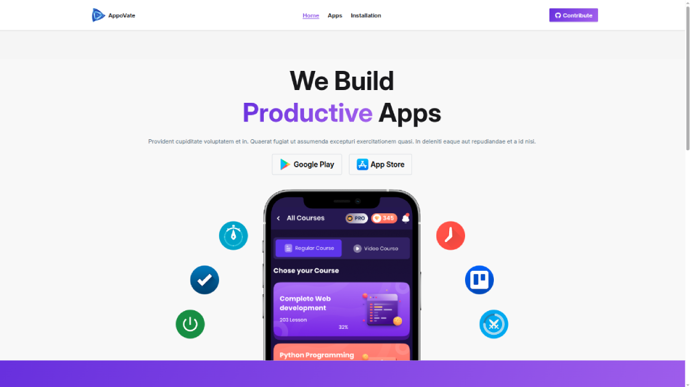

# Project Name: AppoVate
Showcase Your Apps with Style

## Overview
**AppoVate** is a modern web application built with React.js for the front-end and Node.js with Express for the back-end. It showcases apps developed by the company Appovate, offering a real app store-like experience. Users can browse featured/trending apps, use live search, and simulate installing/uninstalling apps. Now, with the addition of a backend, app data is fetched from a MongoDB database, providing real-time updates and improved scalability



## Key Features
- **Browse Featured and Trending Apps**: View featured and trending apps fetched from the backend.
- **All Apps Page**: Access a comprehensive list of all apps with pagination.
- **Live Search**: Search for apps in real-time with instant results.
- **App Sorting**: Sort apps by size, ratings, or download count (ascending or descending).
- **Install/Uninstall Simulation**: Simulate app installations and uninstallations.
- **Persistent Storage**: Installed apps are stored in `localStorage` to persist across sessions.
- **Responsive Design**: Fully responsive UI for mobile, tablet, laptop, and desktop.
- **Realistic App Store UI/UX**: An intuitive and modern design inspired by popular app stores.

## Technologies Used

### Front-end
- HTML
- Tailwind CSS & Daisy UI
- JavaScript
- React.js

### Back-end
- Node.js
- Express Server
- MongoDB (for storing app data)

### Tools and Libraries
- Google Fonts API: For stylish typography.
- React Router: For routing between pages.
- Lucide Icons: For scalable, vector-based icons.

## Project Timeline
- Created on: 9 Oct 2025
- Completed on: 18 Oct 2025
- Last updated on: 24 Nov 2025

## Installation Instructions
To run the AppoVate application locally, follow these steps:

1. Clone the repository:
   ```bash
   git clone https://github.com/nayem-ahmedz/appo-vate.git
   ```
2. Navigate to the project folder:
   ```bash
   cd appo-vate
   ```
3. Install dependencies:
   ```bash
   npm install
   ```
4. Start the development server:
   ```bash
   npm run dev
   ```
## For setting up backend
The back-end for this project is in a separate repository. You can find it here:
[Appovate Server Repo](https://github.com/nayem-ahmedz/appovate-server)

## Contributing
Contributions are welcome! If you have suggestions for improvements, bug fixes, or new features, feel free to open an issue or submit a pull request.

## live link
[Appovate Web](https://appovate.netlify.app/)

Feel free to contact for any query!